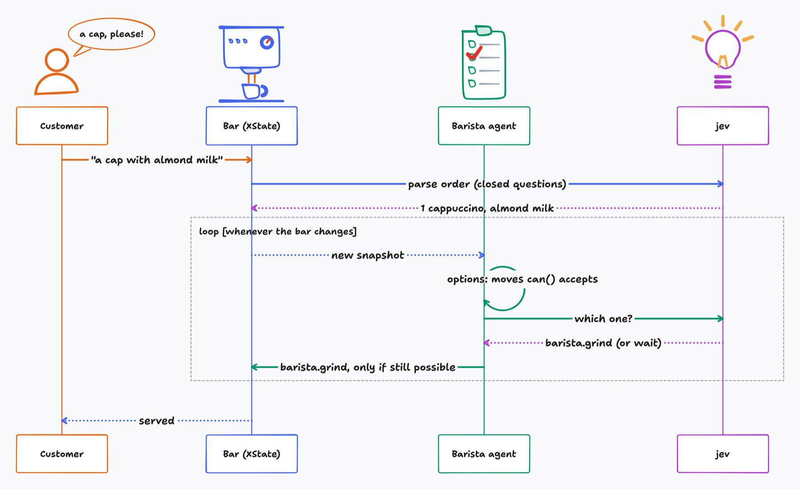

# ☕ Jevspresso

A simulated espresso bar where every barista decision is made by jev, [TypeSafe](https://typesafe.ai)'s System One model. Type an order in plain English ("a cap but with almond milk"), and watch jev grind, tamp, pull shots, steam milk, and serve. You can work the bar too, or break the equipment and see how jev copes.

**Live demo:** <https://jevspresso.davidkpiano.workers.dev>

https://github.com/user-attachments/assets/d95ad69a-1e04-4f4d-b79e-313af55c6a3b

## Motivation

An LLM agent usually acts by writing tool calls, so the app has to check every action after the fact. Jevspresso does it the other way around: an [XState v6](https://stately.ai/docs) machine models what is physically possible at the bar, and jev only chooses among the events the machine accepts right now. jev never writes an action. It picks one from a closed set, and the bar takes it only if it is still possible.

The repo is an example of using XState and jev together, through [`@xstate/jev`](packages/jev/README.md) in `packages/jev`.

## Quick start

```sh
pnpm install
cp .env.template .env   # set TYPESAFE_API_KEY
pnpm dev                # http://localhost:3000
```

Without a key, the page asks for one. `pnpm test` runs without a key, against a mock jev.

## XState + jev in brief

The same pattern as the bar, on a lamp:

```ts
import { createActor, setup, types } from 'xstate';
import { z } from 'zod';
import { createJevLogic } from '@xstate/jev';

const lamp = setup({
  actors: {
    jev: createJevLogic({
      events: 'lamp.*',
      instructions: 'Do what the latest request in `requests` asks, if the lamp is not like that already.',
      noop: 'leave the lamp as it is',
      client, // your server-side TypeSafe call
    }),
  },
}).createMachine({
  schemas: {
    context: types<{ requests: string[] }>(),
    events: {
      'user.request': types<{ text: string }>(),
      // What jev may do: runtime schemas, described.
      'lamp.turnOn': z.object({}).describe('switch the lamp on'),
      'lamp.turnOff': z.object({}).describe('switch the lamp off'),
    },
  },
  context: { requests: [] },
  // jev decides on the lamp whenever it changes.
  invoke: { src: 'jev' },
  // A request is just context: jev sees it change, and acts on it.
  on: {
    'user.request': ({ context, event }) => ({ context: { requests: [...context.requests, event.text] } }),
  },
  initial: 'off',
  states: {
    off: { on: { 'lamp.turnOn': { target: 'on' } } },
    on: { on: { 'lamp.turnOff': { target: 'off' } } },
  },
});

const actor = createActor(lamp).start();
actor.send({ type: 'user.request', text: 'it is getting dark in here' }); // → on
actor.send({ type: 'user.request', text: 'time to sleep' });              // → off
```

`client` sends jev's request to the TypeSafe SDK's `systemOne()` on your server, so the API key stays there. [`src/lib/jev.ts`](src/lib/jev.ts) is the bar's client.

## How it works

<picture>
  <source media="(prefers-color-scheme: dark)" srcset="docs/how-it-works-dark.png" />
  
</picture>

- **The bar** ([`src/machines/espressoBar.ts`](src/machines/espressoBar.ts)) is one parallel machine: order intake, the grinder, espresso machine and steam wand, one portafilter, one milk pitcher, and each barista's hands. It models physics, not recipes. Mistakes are possible; recipes are data the cups are compared against.
- **The barista** is a `createJevLogic` agent invoked at the top of the bar. Whenever the bar changes, it offers jev every `barista.*` event that `can()` accepts, each described in the machine's own words plus what it would change (computed with the pure `transition()`). jev picks one, and the agent sends it if the bar still accepts it.
- **Orders** are parsed by one jev call that answers a set of closed questions about the text (which drinks, how many, which milk). Unclear orders go to a router agent that asks the customer to confirm.
- **`/eval`** runs scenarios (rushes, breakdowns, sabotage) against real jev and reports how many orders were served correctly and what it cost.

## Resources

- [`@xstate/jev`](packages/jev/README.md): options, `createJevLogic`, caching, loop detection, the client
- [XState docs](https://stately.ai/docs)
- [TypeSafe docs](https://docs.typesafe.ai/) and [JavaScript SDK](https://docs.typesafe.ai/sdk/javascript)
